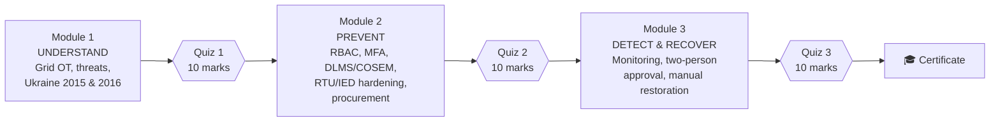
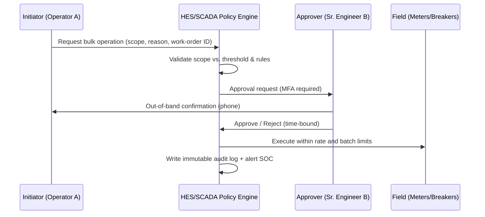

# ⚡ Cybersecurity for Power Grid & SCADA/OT Systems

### Professional Certificate Course for Assistant Engineers — Kaptai Power Grid, Bangladesh

-purple)
-yellow)

> **Mission:** Equip Assistant Engineers with the knowledge, skills and professional judgment to **prevent, detect, mitigate and recover** from cyber incidents affecting distribution SCADA, substations, Advanced Metering Infrastructure (AMI) and prepaid vending systems.

---

## 📑 Table of Contents

1. [Course at a Glance](#-course-at-a-glance)
2. [Who Is This Course For?](#-who-is-this-course-for)
3. [Outcome-Based Education Framework](#-outcome-based-education-framework)
   - [Program Outcomes (PO)](#program-outcomes-po)
   - [Course Learning Outcomes (CLO) with Bloom's Levels](#course-learning-outcomes-clo-with-blooms-levels)
   - [CLO–PO Mapping](#clopo-mapping)
4. [Course Roadmap & Time Allocation](#-course-roadmap--time-allocation)
5. [Module 1 – Foundations, Threat Landscape & Case Studies](#-module-1--foundations-threat-landscape--case-studies-10-h)
6. [Module 2 – Prevention: Secure by Design](#-module-2--prevention-secure-by-design-10-h)
7. [Module 3 – Detection, Mitigation & Recovery](#-module-3--detection-mitigation--recovery-10-h)
8. [Assessment & Certification Rules](#-assessment--certification-rules)
9. [Quiz Blueprints & Sample Questions](#-quiz-blueprints--sample-questions)
10. [Lab Environment, Tools & Safety Rules](#-lab-environment-tools--safety-rules)
11. [Reading List & References](#-reading-list--references)
12. [Glossary](#-glossary)

---

## 🎯 Course at a Glance

| Item | Details |
|---|---|
| **Course Title** | Cybersecurity for Power Grid & SCADA/OT Systems |
| **Credential** | Professional Certificate (Competency-Based) |
| **Total Duration** | **30 contact hours** (≈ 17.75 h theory · 10.75 h labs · 1.5 h quizzes) |
| **Structure** | 3 modules × 10 hours |
| **Suggested Delivery** | 6 days × 5 h **or** 10 evening sessions × 3 h |
| **Assessment** | 3 quizzes × 10 marks = 30 marks, plus lab completion and attendance |
| **Pass Mark** | 18 / 30 (60%) overall, minimum 4 / 10 in each quiz |
| **Language** | English (technical terms), Bangla explanations as needed |
| **Class Size** | 15–25 trainees (labs in pairs) |

### 🗺️ Learning Journey

---

## 👷 Who Is This Course For?

**Target group:** Assistant Engineers (AEs) in Kaptai Power Grid operations, distribution, substation, metering, SCADA/communication and prepaid-vending units.

**Entry profile**

- B.Sc. Engineering in Electrical & Electronic Engineering (EEE) or equivalent
- Working knowledge of power systems, protection and substation equipment
- Basic familiarity with networking (IP, Ethernet) is helpful but **not** mandatory. A 30-minute primer is provided on Day 1.

**You do NOT need** prior cybersecurity or programming experience.

---

## 🧭 Outcome-Based Education Framework

This course follows **Outcome-Based Education (OBE)**. Every module, lab and assessment item traces back to a measurable outcome, written using **Revised Bloom's Taxonomy** action verbs.

### Bloom's Taxonomy Quick Reference

| Level | Cognitive Domain | Typical Verbs | Example in This Course |
|:-:|---|---|---|
| **C1** | Remember | list, name, identify, recall | Name protocols used in substation automation |
| **C2** | Understand | explain, describe, summarize | Explain how DLMS/COSEM protects meter commands |
| **C3** | Apply | configure, implement, demonstrate | Configure RBAC and MFA on a jump host |
| **C4** | Analyze | examine, differentiate, trace | Trace the Ukraine 2015 attack chain |
| **C5** | Evaluate | assess, justify, critique | Assess a vendor RTU against hardening criteria |
| **C6** | Create | design, develop, formulate | Design a two-person approval workflow |

### Program Outcomes (PO)

*Sample POs for the Professional Certificate Program in Power Grid OT Cybersecurity (aligned in spirit with BAETE/Washington Accord graduate attributes, adapted for continuing professional development).*

| Code | Program Outcome | Description |
|:-:|---|---|
| **PO1** | Domain Knowledge | Apply knowledge of power system operation, SCADA/OT architecture and cybersecurity principles to grid protection. |
| **PO2** | Risk & Problem Analysis | Identify, formulate and analyze cyber risks and attack paths in grid systems using established frameworks. |
| **PO3** | Secure Design & Solutions | Design secure configurations, procedures and architectures that meet reliability and safety needs. |
| **PO4** | Modern Tool Usage | Select and use appropriate monitoring, analysis and configuration tools within safe limits. |
| **PO5** | Safety, Ethics & Compliance | Act responsibly regarding public safety, professional ethics, organizational policy and national regulation. |
| **PO6** | Teamwork & Communication | Coordinate with operations, IT, vendors and management during normal and incident conditions. |
| **PO7** | Continuous Learning | Sustain awareness of evolving threats, standards and good practice. |

### Course Learning Outcomes (CLO) with Bloom's Levels

*Upon successful completion of the course, trainees will be able to:*

| CLO | Learning Outcome | Bloom | Module |
|:-:|---|:-:|:-:|
| **CLO1** | **Describe** the architecture, communication protocols and cyber-relevant weaknesses of distribution SCADA, substations, AMI and vending systems. | C1–C2 | M1 |
| **CLO2** | **Analyze** the Ukraine 2015 and Industroyer (2016) incidents to trace attacker stages and identify the control gaps that were exploited. | C4 | M1 |
| **CLO3** | **Apply** role-based access control, multi-factor authentication, privileged access and network segmentation to grid operational environments. | C3 | M2 |
| **CLO4** | **Configure** secure metering communication using DLMS/COSEM security features and key management principles. | C3 | M2 |
| **CLO5** | **Evaluate** RTU/IED security posture and vendor offerings against hardening baselines and secure procurement criteria. | C5 | M2 |
| **CLO6** | **Analyze** network traffic and logs to detect anomalous or unauthorized control and metering commands. | C4 | M3 |
| **CLO7** | **Design** two-person approval controls for bulk disconnection and a manual restoration procedure. | C6 | M3 |
| **CLO8** | **Develop** an incident response and recovery plan, and demonstrate coordinated team response in a tabletop exercise. | C6 | M3 |

### CLO–PO Mapping

*(H = High, M = Medium, L = Low contribution)*

| CLO | PO1 | PO2 | PO3 | PO4 | PO5 | PO6 | PO7 |
|:-:|:-:|:-:|:-:|:-:|:-:|:-:|:-:|
| **CLO1** | **H** | M | | | L | | M |
| **CLO2** | M | **H** | | L | M | | M |
| **CLO3** | M | M | **H** | M | M | | |
| **CLO4** | **H** | | **H** | **H** | | | |
| **CLO5** | M | **H** | **H** | | M | M | |
| **CLO6** | M | **H** | | **H** | | L | |
| **CLO7** | M | M | **H** | | **H** | **H** | |
| **CLO8** | M | M | **H** | M | **H** | **H** | M |

### Outcome → Delivery → Assessment Alignment

| CLO | Teaching Method | Assessment Evidence |
|:-:|---|---|
| CLO1 | Lecture, architecture walkthrough, Lab 1.1 | Quiz 1 (items 1–5), Lab 1.1 worksheet |
| CLO2 | Case-study discussion, ATT&CK-for-ICS mapping, Lab 1.2 | Quiz 1 (items 6–10), ATT&CK mapping sheet |
| CLO3 | Demonstration, hands-on Lab 2.1 | Quiz 2 (items 1–4), Lab 2.1 RBAC matrix |
| CLO4 | Simulator-based Lab 2.2 | Quiz 2 (items 5–7), Lab 2.2 report |
| CLO5 | Audit checklist, Lab 2.3, Lab 2.4 | Quiz 2 (items 8–10), audit and procurement worksheets |
| CLO6 | Pcap/log analysis, Lab 3.1 | Quiz 3 (items 1–4), Lab 3.1 findings |
| CLO7 | Workflow design, Labs 3.2 and 3.3 | Quiz 3 (items 5–8), workflow and SOP deliverables |
| CLO8 | Tabletop exercise, Lab 3.4 | Quiz 3 (items 9–10), IR plan and exercise debrief |

---

## 🕒 Course Roadmap & Time Allocation

| Module | Theme | Theory | Lab | Quiz | **Total** |
|:-:|---|:-:|:-:|:-:|:-:|
| **M1** | Foundations, Threat Landscape & Case Studies | 7.5 h | 2.0 h | 0.5 h | **10 h** |
| **M2** | Prevention: Secure by Design | 5.5 h | 4.0 h | 0.5 h | **10 h** |
| **M3** | Detection, Mitigation & Recovery | 4.75 h | 4.75 h | 0.5 h | **10 h** |
| | **Total** | **17.75 h** | **10.75 h** | **1.5 h** | **30 h** |

> 🔬 Hands-on labs make up about **36%** of contact time.

---

## 📘 Module 1 — Foundations, Threat Landscape & Case Studies (10 h)

**Focus:** Understand what we are protecting, who and what threatens it, and what real attacks teach us.
**CLOs:** CLO1 (C1–C2), CLO2 (C4)

### Module 1 Learning Objectives

By the end of this module you will be able to:

- **List** the main components of a distribution SCADA, substation automation, AMI and vending system *(C1)*
- **Explain** how IT and OT security priorities differ (safety, availability, integrity, confidentiality) *(C2)*
- **Describe** why legacy protocols (IEC 60870-5-101/104, DNP3, Modbus) are exposed when connected to routable networks *(C2)*
- **Differentiate** attack surfaces across SCADA, substations, AMI and vending systems *(C4)*
- **Trace** the stages of the 2015 and 2016 Ukraine attacks against a framework such as MITRE ATT&CK for ICS *(C4)*

### Session Plan

| Session | Topic | Type | Time |
|:-:|---|:-:|:-:|
| 1.1 | Power grid OT fundamentals and the IT/OT security difference | Theory | 1.5 h |
| 1.2 | Distribution SCADA, substation, AMI and vending architectures and protocols | Theory | 2.0 h |
| 1.3 | Threat landscape and attack surfaces | Theory | 1.5 h |
| 1.4 | **Case Study A:** Ukraine distribution grid attack (December 2015) | Case study | 1.25 h |
| 1.5 | **Case Study B:** Industroyer / CrashOverride (December 2016) | Case study | 1.25 h |
| Lab 1.1 | Purdue-model and asset mapping of a sample substation | Lab | 1.0 h |
| Lab 1.2 | Passive protocol traffic analysis (IEC 104 / DNP3 sample captures) | Lab | 1.0 h |
| **Quiz 1** | 10 marks, 30 minutes | Assessment | 0.5 h |

### 📖 Content Detail

#### Session 1.1 — Grid OT Fundamentals (1.5 h)

- Generation, transmission and distribution value chain; where Kaptai's assets fit
- Control hierarchy: field devices → RTU/IED → substation gateway → SCADA/DMS → control centre
- **IT vs OT**: safety and availability first; long asset life (15–30 years); legacy and proprietary protocols; patching constraints; real-time determinism
- The security triad in OT: **Safety and Availability > Integrity > Confidentiality**
- Why cyber incidents on the grid are *physical* incidents (outages, equipment damage, safety risk)
- Primer: IP addressing, switches/routers, firewalls, VLANs, serial-to-Ethernet gateways

#### Session 1.2 — Architectures and Protocols (2.0 h)

- **Distribution SCADA/DMS:** master station, front-end processor, HMI, historian, remote access
- **Substation automation:** RTUs, IEDs and relays, merging units, substation HMI and gateway, time synchronization
- **Protocols and their security posture**

| Protocol | Typical Use | Native Security Weakness |
|---|---|---|
| IEC 60870-5-101/104 | SCADA ↔ RTU | No authentication or encryption in base standard |
| DNP3 | SCADA ↔ RTU/IED | Authentication only with Secure Authentication (SA) extension |
| Modbus RTU/TCP | Field devices | No authentication, plain commands |
| IEC 61850 (MMS/GOOSE/SV) | Substation automation | GOOSE/SV multicast is unauthenticated by default |
| DLMS/COSEM (IEC 62056) | Smart meters | Security is **optional and must be enabled** |
| OPC DA/UA | Data integration | DA relies on legacy DCOM; UA has built-in security if configured |

- **AMI architecture:** smart meter → data concentrator/DCU → communication network (RF mesh, PLC, GPRS/cellular) → Head-End System (HES) → MDMS → billing
- **Prepaid / vending systems:** vending station, token generation (STS), Hardware Security Module (HSM), key management, token loading
- Remote disconnect/reconnect relays in meters: the feature that makes AMI both useful and dangerous

#### Session 1.3 — Threat Landscape and Attack Surfaces (1.5 h)

- Threat actor categories: nation-state, criminal (ransomware), hacktivist, insider, negligent insider, supply chain
- **Attack surface by asset class**

| Asset | Example Exposure |
|---|---|
| Distribution SCADA | Corporate-to-OT pivot, remote access/VPN, shared credentials, flat networks |
| Substations | Weak physical security, default passwords, exposed engineering ports, unsecured serial gateways |
| AMI | Weak or default meter keys, HES compromise, exposed DCU services, mass remote-disconnect abuse |
| Vending | Stolen operator credentials, compromised key store, token-generation abuse, fraud |
| People and process | Phishing, shared accounts, vendor remote access, lack of change control |

- Introduction to **MITRE ATT&CK for ICS** and the ICS cyber kill chain concept
- Consequence scale: single feeder → substation → regional outage → cascading effects

#### Session 1.4 — Case Study A: Ukraine Distribution Grid Attack, 23 Dec 2015 (1.25 h)

*Focus on **lessons for defenders**.*

- **Impact (publicly reported):** three regional distribution companies affected; roughly 225,000 customers lost power for several hours; service restored mostly by **manual operation** of breakers.
- **Attack stages (high level)**
  1. Months of IT-network intrusion (spear-phishing with malicious Office documents)
  2. Credential theft and movement into the OT environment via **VPN access** and weak segmentation
  3. Preparation: attackers studied SCADA/HMI and operations
  4. Execution: operators' own SCADA/HMI used to open breakers; firmware of serial-to-Ethernet converters corrupted; UPS systems targeted; wiper malware (KillDisk); telephone denial-of-service on customer call centres
  5. Recovery depended on staff who could operate breakers manually
- **Defender lessons:** segmentation of IT/OT, MFA on remote access, privileged-account control, firmware integrity, monitoring of operator commands, maintained manual-operation capability
- **Group exercise (20 min):** map each stage to ATT&CK for ICS and to a **preventive / detective / recovery** control

#### Session 1.5 — Case Study B: Industroyer / CrashOverride, 17 Dec 2016 (1.25 h)

- **Impact (publicly reported):** transmission substation near Kyiv; about an hour-long outage with significant load lost; automatically recovered by operators.
- **Why it matters:** first widely documented malware framework built to *speak grid protocols natively*
  - Payload modules for **IEC 60870-5-101, IEC 60870-5-104, IEC 61850 and OPC DA**
  - Included a wiper component and a protection-relay denial-of-service component
- **Key insight:** protocols without authentication let any party that reaches the network issue valid-looking commands. A follow-on variant ("Industroyer2") appeared in 2022 targeting IEC-104.
- **Defender lessons:** network allow-listing of command sources, protocol-aware inspection, authenticated protocols (IEC 62351 / DNP3-SA), baseline of normal control traffic, offline backups
- **Compare and contrast table (group task):**

| Dimension | 2015 | 2016 |
|---|---|---|
| Level attacked | Distribution control (operators' HMI) | Transmission substation devices |
| Method of control | Remote use of existing operator tools | Custom malware speaking native protocols |
| Automation level | Largely manual attacker actions | Automated and scalable |
| Recovery | Manual breaker operation | Operator manual restoration |
| Principal gaps | Remote access, segmentation, credentials | Protocol authentication, monitoring |

### 🧪 Module 1 Labs

#### Lab 1.1 — Purdue Model and Asset Mapping of a Sample Substation (1.0 h) · CLO1

| | |
|---|---|
| **Objective** | Classify assets and data flows, and identify trust boundaries |
| **Setup** | Printed/PDF single-line and communication diagram of a **fictitious** 33/11 kV substation + control centre |
| **Tasks** | (1) List all devices and place them on Purdue levels 0–5. (2) Mark every protocol and data flow. (3) Highlight points where IT touches OT (remote access, vendor links, USB, modems). (4) Rank the top 5 risk points. |
| **Deliverable** | Annotated diagram + asset inventory table (device, function, protocol, owner, criticality) |
| **Bloom** | C2 / C4 |

#### Lab 1.2 — Passive Protocol Traffic Analysis (1.0 h) · CLO1, CLO2

| | |
|---|---|
| **Objective** | See firsthand that classic OT protocols carry commands in clear text without authentication |
| **Setup** | Trainer-provided **sample .pcap files** (IEC 60870-5-104, DNP3, Modbus) opened offline in Wireshark. No live networks are touched. |
| **Tasks** | (1) Identify master/outstation addresses. (2) Locate a control command and decode the target point. (3) Answer: what would prevent a rogue host from sending the same command? (4) Note which fields would need to be authenticated. |
| **Deliverable** | One-page findings sheet |
| **Bloom** | C3 / C4 |

---

## 🛡️ Module 2 — Prevention: Secure by Design (10 h)

**Focus:** Build security into access, communications, devices and purchasing decisions.
**CLOs:** CLO3 (C3), CLO4 (C3), CLO5 (C5)

### Module 2 Learning Objectives

By the end of this module you will be able to:

- **Design** a role-based access matrix for SCADA/DMS, HES, MDMS and vending systems using least privilege *(C3)*
- **Implement** MFA and controlled remote/vendor access via a jump host *(C3)*
- **Configure** DLMS/COSEM authentication and encryption and explain key management duties *(C3)*
- **Assess** RTU/IED security posture using a hardening checklist *(C5)*
- **Evaluate** vendor proposals using secure-procurement criteria *(C5)*

### Session Plan

| Session | Topic | Type | Time |
|:-:|---|:-:|:-:|
| 2.1 | Defense in depth, segmentation, zones and conduits (IEC 62443) | Theory | 1.0 h |
| 2.2 | Identity and access: RBAC, MFA, privileged and remote access | Theory | 1.0 h |
| 2.3 | AMI and vending security: DLMS/COSEM, key management, STS tokens | Theory | 1.5 h |
| 2.4 | RTU/IED/substation hardening and IEC 62351 | Theory | 1.0 h |
| 2.5 | Secure procurement and lifecycle management | Theory | 1.0 h |
| Lab 2.1 | RBAC matrix and MFA-protected jump host | Lab | 1.0 h |
| Lab 2.2 | DLMS/COSEM secured association on a simulator | Lab | 1.5 h |
| Lab 2.3 | RTU/IED hardening audit | Lab | 1.0 h |
| Lab 2.4 | Secure procurement specification review | Lab | 0.5 h |
| **Quiz 2** | 10 marks, 30 minutes | Assessment | 0.5 h |

### 📖 Content Detail

#### Session 2.1 — Defense in Depth and Segmentation (1.0 h)

- Layered defense: policy → network → host → application → data → physical
- **Zones and conduits** (IEC 62443-3-2/3-3): corporate, DMZ, control centre, substation, field, AMI field network, vending
- Firewall design: default-deny, protocol-aware rules, unidirectional gateways/data diodes for historian export
- Separating AMI/HES and vending from SCADA networks
- Secure remote access architecture: no direct internet exposure; jump host in DMZ; session recording

#### Session 2.2 — Identity and Access Management (1.0 h)

- **Role-Based Access Control (RBAC)**: roles such as *Viewer, Operator, Senior Operator, Engineer, Administrator, Vendor (time-limited), Auditor*
- Principles: **least privilege, separation of duties, need-to-know**, no shared accounts, unique IDs for every person
- **MFA** for: remote access, engineering workstations, HES/MDMS admin consoles, vending back-office, privileged operations
- Privileged Access Management (PAM): vaulting, just-in-time access, session recording, rotated passwords
- Joiner-mover-leaver process and periodic access recertification
- Local fallback: emergency (break-glass) accounts with sealed credentials and mandatory post-use review
- **Illustrative RBAC matrix** (to be refined in Lab 2.1)

| Function | Viewer | Operator | Sr. Operator | Engineer | Admin | Vendor |
|---|:-:|:-:|:-:|:-:|:-:|:-:|
| View SCADA data | ✔ | ✔ | ✔ | ✔ | ✔ | ✔ (scoped) |
| Operate single breaker | | ✔ | ✔ | | | |
| Bulk feeder switching | | | ✔ (+approval) | | | |
| Change RTU config | | | | ✔ | | ✔ (time-limited) |
| Manage users and keys | | | | | ✔ | |
| Bulk meter disconnect | | | ✔ (+2nd approver) | | | |

#### Session 2.3 — AMI and Vending Security (1.5 h)

- **DLMS/COSEM security features (IEC 62056-5-3 and Green Book)**
  - Authentication levels: no security / low-level (password) / **high-level (HLS)**, e.g. GMAC-based
  - Message protection: **authentication, encryption, or both** for APDUs
  - Security suites: **Suite 0** (AES-GCM-128), **Suite 1** (adds ECDH/ECDSA P-256), **Suite 2** (P-384 and AES-256)
  - Key types: master key (KEK), global unicast encryption key (GUEK), global broadcast key, authentication key (AK), and the **invocation counter** (replay protection)
- **Key management essentials**
  - **Unique keys per meter**; never a shared fleet-wide default key
  - Utility-owned keys: do not leave key custody solely with a vendor
  - Keys stored in an HSM or secured key server; key rotation plan; dual control for key ceremonies
  - Factory/default keys changed at commissioning (SAT check)
- **Other AMI controls:** DCU/HES hardening, secure firmware update (signed images), tamper detection and alarms, secure APN/VPN for cellular, rate limits on remote disconnect commands
- **Vending systems:** STS token generation within an HSM, secured vending keys and key-change procedures, vendor/operator authentication with MFA, transaction logging and reconciliation, separation between operator, supervisor and administrator roles, fraud analytics

#### Session 2.4 — RTU/IED/Substation Hardening (1.0 h)

- **Hardening baseline**
  - Change all default credentials; unique, strong passwords; centralized authentication where supported
  - Disable unused services and ports (HTTP, FTP, Telnet, SNMPv1/2, debug interfaces)
  - Enable secure protocols (TLS/SSH, SNMPv3); restrict management to a defined engineering subnet
  - **Firmware integrity**: signed firmware only, controlled upgrade process, hash verification
  - Configuration backup, change logging and periodic comparison to the baseline
  - Time synchronization from authenticated sources
  - Physical security: locked cabinets, port blockers, USB/media control, tamper alarms, Local/Remote switch discipline
  - Serial-to-Ethernet gateways and modems: inventory, lock down, or remove
- **IEC 62351 overview:** TLS for IEC 104 (Part 3), authentication in profiles (Part 5), role-based access (Part 8), key management (Part 9); **DNP3 Secure Authentication** as comparable control
- Patch/vulnerability management in OT: test first, maintenance windows, compensating controls when patching isn't possible

#### Session 2.5 — Secure Procurement and Lifecycle (1.0 h)

- Security requirements in tender documents (RFP/SoW)
  - Compliance or alignment with **IEC 62443-4-1 / 4-2 / 3-3**
  - No hard-coded or shared default credentials; support for RBAC, logging and secure protocols
  - **Software Bill of Materials (SBOM)** and vulnerability disclosure/patch commitments
  - Defined **support lifetime**, signed firmware and updates
  - Right to security testing, **FAT/SAT with security test cases**
  - Controlled vendor remote maintenance (utility-approved, time-bound, logged)
  - Breach-notification obligations and key/data ownership clauses
  - Secure decommissioning and data wiping
- Supply-chain risk: counterfeit components, third-party software, vendor access
- Total cost of ownership view: security as lifecycle cost, not an add-on

### 🧪 Module 2 Labs

#### Lab 2.1 — RBAC Matrix and MFA-Protected Jump Host (1.0 h) · CLO3

| | |
|---|---|
| **Objective** | Translate least-privilege into a working access design |
| **Setup** | Virtual lab: a training SCADA HMI (simulated) behind a jump-host VM; an authentication server with TOTP-based MFA |
| **Tasks** | (1) Complete an RBAC matrix for a given set of Kaptai-style roles. (2) Create roles/users on the lab system. (3) Enable MFA on the jump host and test a remote session. (4) Demonstrate that a Viewer cannot operate a control point. (5) Review session logs. |
| **Deliverable** | Completed RBAC matrix + test evidence (screenshots/log extract) |
| **Bloom** | C3 |

#### Lab 2.2 — DLMS/COSEM Secured Association on a Simulator (1.5 h) · CLO4

| | |
|---|---|
| **Objective** | See the difference between an unsecured and a secured meter session |
| **Setup** | Open-source DLMS client and a **meter simulator** (e.g., Gurux DLMS Director with a simulated meter), running only on lab machines |
| **Tasks** | (1) Connect with no security and read registers. (2) Enable HLS authentication and AES-GCM encryption with a lab-generated key set. (3) Attempt a read with a wrong/missing key and observe the rejection. (4) Examine invocation-counter behavior. (5) Draft a key-lifecycle table (generation, storage, injection, rotation, revocation). |
| **Deliverable** | Lab report with screenshots + key-lifecycle table |
| **Bloom** | C3 |

> ⚠️ Use only lab-generated, non-production keys. Never bring real meter keys into the lab.

#### Lab 2.3 — RTU/IED Hardening Audit (1.0 h) · CLO5

| | |
|---|---|
| **Objective** | Audit a device configuration against the hardening baseline |
| **Setup** | Provided **configuration exports** and screenshots of a sample RTU/IED (or a virtual device), plus a hardening checklist |
| **Tasks** | (1) Score each checklist item *Pass / Partial / Fail*. (2) Identify the three highest-risk findings. (3) Recommend corrective actions with priority and owner. (4) Decide which items need compensating controls because patching is impractical. |
| **Deliverable** | Completed audit sheet with prioritized remediation plan |
| **Bloom** | C4 / C5 |

#### Lab 2.4 — Secure Procurement Specification Review (0.5 h) · CLO5

| | |
|---|---|
| **Objective** | Evaluate proposals through a security lens |
| **Setup** | Excerpts from two **fictitious** vendor proposals for AMI meters/DCUs |
| **Tasks** | Score both against a procurement security checklist; identify missing clauses; recommend which to shortlist and justify. |
| **Deliverable** | Scored checklist + 5-line justification |
| **Bloom** | C5 |

---

## 🚨 Module 3 — Detection, Mitigation & Recovery (10 h)

**Focus:** Assume prevention can fail. Detect quickly, limit blast radius, and restore safely, including by hand.
**CLOs:** CLO6 (C4), CLO7 (C6), CLO8 (C6)

### Module 3 Learning Objectives

By the end of this module you will be able to:

- **Analyze** OT network traffic and logs to spot unauthorized or abnormal commands *(C4)*
- **Design** a two-person approval workflow for bulk disconnection and other high-impact operations *(C6)*
- **Develop** a manual restoration procedure that works when SCADA/AMI is unavailable *(C6)*
- **Formulate** an incident response plan with roles, escalation and communication *(C6)*
- **Justify** decisions in a realistic exercise while observing safety and regulatory duties *(C5)*

### Session Plan

| Session | Topic | Type | Time |
|:-:|---|:-:|:-:|
| 3.1 | OT security monitoring and anomaly detection | Theory | 1.5 h |
| 3.2 | High-impact command safeguards: two-person approval for bulk disconnect | Theory | 1.0 h |
| 3.3 | Incident response, manual operation and restoration | Theory | 1.25 h |
| 3.4 | Governance, regulation, culture and drills | Theory | 1.0 h |
| Lab 3.1 | Passive monitoring and detection on sample traffic and logs | Lab | 1.5 h |
| Lab 3.2 | Two-person approval workflow design and simulation | Lab | 1.0 h |
| Lab 3.3 | Manual restoration drill (tabletop + SOP writing) | Lab | 1.0 h |
| Lab 3.4 | Capstone tabletop: "Ukraine-style" scenario on a Kaptai-like feeder network | Lab | 1.25 h |
| **Quiz 3** | 10 marks, 30 minutes | Assessment | 0.5 h |

### 📖 Content Detail

#### Session 3.1 — Monitoring and Detection (1.5 h)

- What to monitor: control commands, new devices/IPs, new protocol function codes, configuration/firmware changes, logins (especially off-hours or privileged), remote sessions, AMI mass operations
- **Passive network monitoring** (no disruption to OT): SPAN/TAP, OT-aware IDS such as Zeek or Suricata with ICS protocol parsers, or commercial OT monitoring platforms
- **Baselining:** normal masters, normal polling intervals, normal command types; alerts on deviation
- Log sources: firewalls, jump hosts, SCADA servers, HES/MDMS, vending back-office, authentication servers; centralized log collection (SIEM) and **time synchronization**
- **Use-case examples**

| Use Case | Detection Idea |
|---|---|
| Unauthorized master sending IEC-104 control | Alert on control ASDUs from IPs not on the allow-list |
| Burst of breaker-open commands | Threshold on commands per minute/feeder |
| Mass meter disconnect | Alert on disconnect volume vs. daily norm; require approval (see 3.2) |
| New firmware/config pushed to RTU | Change event outside approved window |
| Off-hours privileged login | Correlate with work orders |
| Vending anomalies | Unusual token volumes, new operator terminals, repeated key-change attempts |

- SOC–operations coordination: who triages, who decides, who acts; alert fatigue and tuning
- Threat hunting basics and integrating threat intelligence (e.g., national CERT advisories)

#### Session 3.2 — Safeguards for High-Impact Commands (1.0 h)

- **Why:** both Ukraine incidents and AMI risk models show that one compromised account can create wide-area impact
- **Two-person (four-eyes) approval for bulk disconnection**
  - **Trigger rules:** any request above a defined threshold (e.g., number of meters, aggregate MW, number of feeders/breakers) or any "all-in-area" operation
  - **Separation of duties:** initiator ≠ approver; approver must hold the proper role and be authenticated with MFA
  - **Out-of-band confirmation:** verify via voice/phone with a known contact or a separate approval channel
  - **Scope limits:** maximum batch size per request; geographic or feeder whitelist; rate limits and cool-down timers
  - **Time-bound approvals** with automatic expiry; immutable audit trail
  - **Break-glass path** for emergencies with extra logging and mandatory post-event review
  - **Business-rule validation:** check against outage plans, work orders, load-shedding schedules, and customer-priority lists (hospitals, water, etc.)
- Equivalent controls for SCADA: dual authorization for multi-breaker or feeder-group operations; interlocks and operating-mode restrictions
- Change management and configuration control for RTU/HES/DCU changes

#### Session 3.3 — Incident Response and Manual Restoration (1.25 h)

- IR lifecycle (adapted from NIST SP 800-61 / SANS): **Prepare → Detect → Analyze → Contain → Eradicate → Recover → Lessons learned**
- OT-specific priorities: **safety first**, preserve grid stability, avoid destructive "reboot everything" reactions, preserve evidence
- **Containment options:** isolate IT/OT conduits, disable remote access, block suspect accounts, switch devices to **local control**
- **Manual operation and restoration**
  - Keep up-to-date **switching procedures and single-line diagrams** offline
  - Local/Remote switch practice and field crew readiness; independent communications (radio/phone) not dependent on IT
  - **Permit-to-work, lock-out/tag-out** and safe-switching discipline still apply
  - Restoration priority list (critical loads first), staged re-energization, coordination between control centre and field teams
  - Spare/clean equipment (e.g., serial gateways, RTU configs), **offline golden backups** of configurations and firmware
  - Verify integrity before returning to remote operation
- Communication plan: internal escalation, management, regulator/national CERT, customers and media
- Business continuity for AMI/vending: manual billing and token alternatives, call-centre resilience

#### Session 3.4 — Governance, Regulation and Culture (1.0 h)

- Security governance: policy, roles (CISO/OT security lead), risk register, KPIs
- Standards and good practice: **IEC 62443, IEC 62351, ISO/IEC 27001 (with 27019 for energy), NIST SP 800-82, NERC CIP (as a reference model)**
- **Bangladesh context:** Cyber Security Act 2023, national cybersecurity strategy and the national CIRT (BGD e-GOV CIRT) incident-reporting channels, with organizational policy of BPDB/PGCB/BREB/distribution utilities. *Always confirm the current legal text and reporting procedures with your Legal/ICT unit.*
- Human factors: phishing awareness, removable-media discipline, vendor access etiquette, reporting culture (no blame)
- Drills and exercises: tabletop, functional, full-scale; metrics (time-to-detect, time-to-contain, time-to-restore)
- Ethics: authorized testing only; responsible disclosure; protecting customer data

### 🧪 Module 3 Labs

#### Lab 3.1 — Passive Monitoring and Detection (1.5 h) · CLO6

| | |
|---|---|
| **Objective** | Detect unauthorized control activity from traffic and logs |
| **Setup** | Lab VM with Wireshark/Zeek/Suricata and a SIEM-lite (e.g., Security Onion or ELK). Trainer-provided **normal-baseline pcap** and an **"incident" pcap/log set** containing injected, clearly labeled anomalies. Offline only. |
| **Tasks** | (1) Build a baseline: masters, outstations, command types. (2) Write 3 detection rules (e.g., control command from non-allow-listed IP; burst of commands; off-hours admin login). (3) Run rules on the incident data and triage alerts. (4) Produce a timeline of suspicious events. |
| **Deliverable** | Rule set + alert triage notes + incident timeline |
| **Bloom** | C3 / C4 |

#### Lab 3.2 — Two-Person Approval Workflow Design and Simulation (1.0 h) · CLO7

| | |
|---|---|
| **Objective** | Design and test a four-eyes control for bulk disconnection |
| **Setup** | Workflow template + role-play with a simulated HES console (or a spreadsheet/form-based simulator provided by the trainer) |
| **Tasks** | (1) Define thresholds, roles, and approval rules. (2) Draw the workflow (sequence/flowchart). (3) Run three scenarios in pairs: *planned load-shedding*, *non-payment batch*, *suspicious mass-disconnect request*. (4) Record where the control stopped or delayed the request and any usability gaps. (5) Define the break-glass rule. |
| **Deliverable** | Approval policy (1 page) + workflow diagram + scenario results |
| **Bloom** | C5 / C6 |

#### Lab 3.3 — Manual Restoration Drill (1.0 h) · CLO7

| | |
|---|---|
| **Objective** | Prepare a usable manual-restoration SOP |
| **Setup** | Single-line diagram of a fictitious 33/11 kV substation and 6 feeders; scenario: SCADA and communications unavailable after a cyber incident |
| **Tasks** | (1) Write a step-by-step restoration SOP (isolate, verify, switch, re-energize in stages). (2) Define communication and roles (control room, field crew, safety officer). (3) List prerequisites (offline docs, spares, tools, permits). (4) Walk through the SOP in a short tabletop. |
| **Deliverable** | Manual restoration SOP + prerequisites checklist |
| **Bloom** | C6 |

#### Lab 3.4 — Capstone Tabletop: Ukraine-Style Scenario on a Kaptai-Like Network (1.25 h) · CLO8

| | |
|---|---|
| **Objective** | Apply the whole course in a realistic, facilitated exercise |
| **Setup** | Teams of 4–5 with assigned roles (Control Room, OT Engineer, IT/Network, Field Operations, Management/Comms). Trainer injects timed events. |
| **Scenario outline** | Phishing foothold → suspicious VPN login → unexpected breaker-open events on several feeders → AMI mass-disconnect attempt → loss of HMI visibility → customer call surge |
| **Tasks** | Detect, decide, contain, restore, communicate; record decisions and rationale. |
| **Deliverable** | Team IR plan (1–2 pages) + 10-minute debrief with lessons learned and gap list |
| **Bloom** | C5 / C6 |

---

## 📝 Assessment & Certification Rules

| Component | Marks | When |
|---|:-:|---|
| Quiz 1 (Module 1) | 10 | End of Module 1 |
| Quiz 2 (Module 2) | 10 | End of Module 2 |
| Quiz 3 (Module 3) | 10 | End of Module 3 |
| **Total** | **30** | |

**Certification requirements**

- ✅ Overall score of at least **18 / 30 (60%)**, with at least **4 / 10** in every quiz
- ✅ Minimum **80% attendance** across the 30 hours
- ✅ Satisfactory submission of **all lab deliverables** (completion-based, pass/needs-revision)
- ✅ Adherence to lab safety and ethics rules

**Grading bands (suggested)**

| Score | Result |
|:-:|---|
| 24–30 | Distinction |
| 21–23 | Merit |
| 18–20 | Pass |
| < 18 | Not yet competent. One re-assessment is permitted. |

> 💡 *Optional extension for the institution:* add a short practical or capstone rubric as formal assessment of CLO7/CLO8 if you wish to grade labs beyond completion.

---

## ❓ Quiz Blueprints & Sample Questions

*Each quiz: **10 items × 1 mark**, 30 minutes, closed book (one A4 formula/notes sheet allowed). Format: 7 MCQ/true-false/matching + 3 short structured answers.*

### Quiz 1 Blueprint (Module 1)

| Bloom Level | Items | CLO |
|---|:-:|:-:|
| Remember (C1) | 3 | CLO1 |
| Understand (C2) | 4 | CLO1 |
| Analyze (C4) | 3 | CLO2 |

**Sample questions**

1. **(C1 · MCQ)** Which of the following is a security weakness of the base IEC 60870-5-104 protocol?
   a) It cannot carry control commands  b) It has no built-in authentication or encryption  c) It works only on serial links  d) It requires a PKI to operate
2. **(C2 · Short)** Explain, in two or three sentences, why "availability and safety" take priority over "confidentiality" in OT environments.
3. **(C4 · Short)** From the 2015 Ukraine incident, name **three** actions of the attackers other than opening breakers, and state **one** control that could have limited each.

### Quiz 2 Blueprint (Module 2)

| Bloom Level | Items | CLO |
|---|:-:|:-:|
| Understand (C2) | 2 | CLO3, CLO4 |
| Apply (C3) | 4 | CLO3, CLO4 |
| Analyze (C4) | 2 | CLO4, CLO5 |
| Evaluate (C5) | 2 | CLO5 |

**Sample questions**

1. **(C3 · MCQ)** A vendor engineer needs to update an RTU configuration next week. Which approach best follows least privilege?
   a) Share the Engineer account password  b) Create a named, time-limited account with MFA via the jump host, and log the session  c) Open a direct VPN to the substation  d) Give the vendor the Administrator role permanently
2. **(C2 · MCQ)** In DLMS/COSEM, which combination protects a meter command from both tampering and eavesdropping?
   a) Low-level (password) authentication only  b) No security  c) Authenticated encryption (e.g., AES-GCM) with a unique per-meter key  d) A shared fleet-wide key stored in the HES
3. **(C5 · Short)** A tender response offers meters with a single default key for the entire fleet, and no SBOM. Give **three** reasons this proposal should be rejected or conditioned.

### Quiz 3 Blueprint (Module 3)

| Bloom Level | Items | CLO |
|---|:-:|:-:|
| Apply (C3) | 2 | CLO6 |
| Analyze (C4) | 3 | CLO6 |
| Evaluate (C5) | 2 | CLO7, CLO8 |
| Create (C6) | 3 | CLO7, CLO8 |

**Sample questions**

1. **(C4 · MCQ)** Which observation in a passive monitor is the **strongest** indicator of a possible attack on a substation?
   a) A scheduled historian poll every 10 s  b) A control command to a breaker from an IP that is not on the master allow-list  c) A routine NTP sync  d) A maintenance login during an approved work order
2. **(C6 · Short)** Specify the minimum elements of a two-person approval rule for disconnecting more than 500 meters in one request (thresholds, roles, verification, logging).
3. **(C6 · Short)** List the first five actions your team should take if SCADA visibility is lost and unexpected breaker operations are reported. Justify the order.

---

## 🖥️ Lab Environment, Tools & Safety Rules

### Recommended Tools (open source / free where possible)

| Purpose | Tools |
|---|---|
| Packet analysis | Wireshark (with IEC 104, DNP3, Modbus dissectors) |
| OT-aware monitoring | Zeek (+ ICS protocol parsers), Suricata, Security Onion or ELK |
| DLMS/COSEM | Gurux DLMS Director / simulator |
| MFA / identity | Open-source TOTP authentication (e.g., FreeIPA/Keycloak/privacyIDEA) |
| Virtualization | VirtualBox or VMware, 8 GB RAM per lab PC recommended |
| Documentation | Draw.io/diagrams.net, spreadsheet software |

### Lab Infrastructure Requirements

- Isolated training network or air-gapped lab PCs with **no connection to any production system**
- Pre-built VM images and sample capture files distributed by the trainer
- Simulated/fictitious data only (no real customer, meter, or key data)

### 🔒 Rules of Engagement (Mandatory)

1. **Defensive purpose only.** This course teaches protection, detection and recovery. It does not teach building or deploying attack tools.
2. **Lab-only practice.** Never scan, probe, or send traffic to any production or third-party system, in or outside Kaptai.
3. **No real keys or credentials** in the lab; use only lab-generated material.
4. **Follow safety rules** for any physical equipment (permit-to-work, lock-out/tag-out).
5. **Report** any vulnerability you discover in your workplace through the official channel, not informally.
6. **Confidentiality:** do not share sensitive diagrams, configurations or incident details outside authorized channels.

---

## 📚 Reading List & References

> Titles are listed for guidance; check for the latest editions and official download locations.

**Standards and guidance**

- IEC 62443 series — Industrial Automation and Control Systems Security (4-1, 4-2, 3-2, 3-3)
- IEC 62351 series — Power systems information exchange: security
- IEC 62056 / DLMS-COSEM (DLMS UA "Blue Book" and "Green Book")
- NIST SP 800-82 — Guide to Operational Technology (OT) Security
- NIST SP 800-61 — Computer Security Incident Handling Guide
- ISO/IEC 27001 and ISO/IEC 27019 (energy utility industry)
- NERC CIP standards (as a reference model)
- MITRE ATT&CK® for ICS

**Case-study material**

- E-ISAC / SANS ICS: *Analysis of the Cyber Attack on the Ukrainian Power Grid* (2016)
- CISA/ICS-CERT alert on the Ukraine 2015 incident
- ESET: *Win32/Industroyer: A new threat for industrial control systems* (2017)
- Dragos: *CRASHOVERRIDE: Analyzing the Threat to Electric Grid Operations* (2017)
- Public reporting and vendor/government analyses of *Industroyer2* (2022)

**Bangladesh context (verify current versions)**

- Cyber Security Act, 2023
- National Cybersecurity Strategy of Bangladesh
- BGD e-GOV CIRT advisories and incident-reporting procedures

---

## 📖 Glossary

| Term | Meaning |
|---|---|
| **AMI** | Advanced Metering Infrastructure |
| **AK / EK / KEK** | Authentication Key / Encryption Key / Key-Encrypting Key (DLMS) |
| **ASDU** | Application Service Data Unit (IEC 60870-5) |
| **COSEM** | Companion Specification for Energy Metering |
| **DCU** | Data Concentrator Unit |
| **DLMS** | Device Language Message Specification |
| **DMS** | Distribution Management System |
| **GMAC / GCM** | Galois Message Authentication Code / Galois-Counter Mode |
| **HES** | Head-End System (AMI) |
| **HLS / LLS** | High-Level / Low-Level Security (DLMS authentication) |
| **HSM** | Hardware Security Module |
| **IED** | Intelligent Electronic Device |
| **MDMS** | Meter Data Management System |
| **MFA** | Multi-Factor Authentication |
| **OT** | Operational Technology |
| **PAM** | Privileged Access Management |
| **RBAC** | Role-Based Access Control |
| **RTU** | Remote Terminal Unit |
| **SBOM** | Software Bill of Materials |
| **SCADA** | Supervisory Control and Data Acquisition |
| **STS** | Standard Transfer Specification (prepaid token standard) |

---

## 🤝 Trainee Checklist

- [ ] Complete the 30-minute networking primer before Day 1 (if new to IP networking)
- [ ] Bring a laptop (or confirm lab PC allocation) and your institutional ID
- [ ] Read the [Rules of Engagement](#-rules-of-engagement-mandatory)
- [ ] Bring one real-world question from your own substation or feeder experience for the Module 3 discussion
- [ ] Review Module notes the evening before each quiz

---

<b>Secure the grid. Keep the lights on. Protect the people who depend on them. ⚡</b>

<i>Version 1.0 · Prepared for Kaptai Power Grid Assistant Engineers · Draft for institutional review and adaptation</i>

